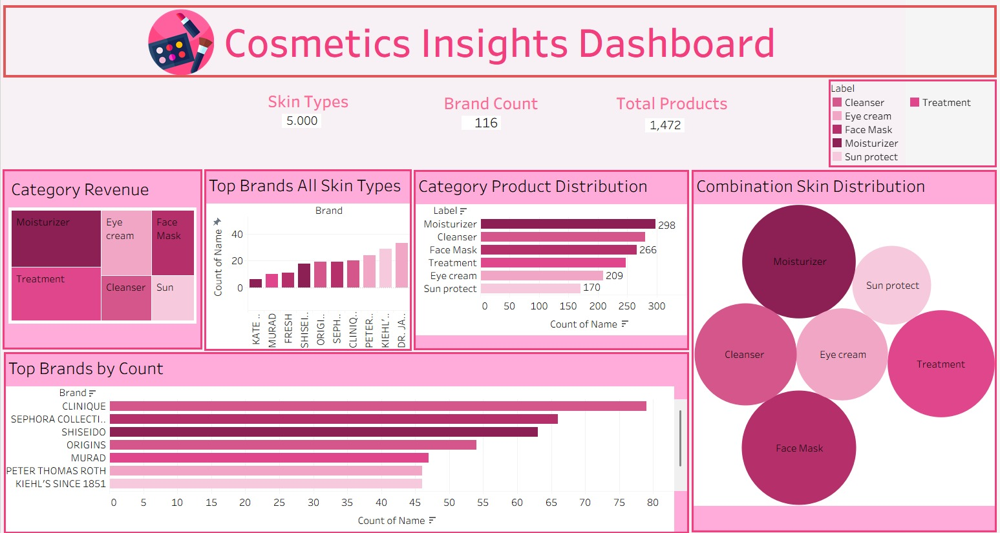

# Cosmetic Insights: Navigating Cosmetics Trends and Consumer Behavior with Tableau

An interactive Tableau dashboard analyzing product data across **116 brands** and **1,472 products** in the skincare and cosmetics space, built to uncover trends in pricing, category distribution, and skin-type suitability.

## Overview

The cosmetics industry is one of the fastest-growing and most competitive sectors, shaped by changing consumer preferences, diverse skin types, brand innovation, and evolving pricing strategies. As demand for personalized beauty products grows, companies increasingly rely on data-driven insights to understand market trends, consumer behavior, and product performance.

This project analyzes a cosmetics dataset — covering brand, product category, price, rank, and skin-type suitability (Dry, Oily, Combination, Normal, Sensitive) — to surface actionable insights for brand performance, pricing patterns, product distribution, and skin-type coverage.

## Dashboard Highlights

- **KPI Summary Layer** — Total skin types (5,000), brand count (116), and total products (1,472) at a glance
- **Category Revenue** — Distribution across Moisturizer, Treatment, Eye Cream, Face Mask, Cleanser, and Sun Protect
- **Top Brands (All Skin Types)** — Ranked bar chart of leading brands (KATE, MUSAQ, SHISEI, DIOR, SEPH, PETER, KIEHL, DR. JA, and more)
- **Category Product Distribution** — Horizontal bar breakdown by product label (Moisturizer, Cleanser, Face Mask, Treatment, Eye Cream, Sun Protect)
- **Top Brands by Count** — Bar chart of the highest product-count brands, including Clinique, Sephora Collection, Shiseido, Origins, Murad, Peter Thomas Roth, and Kiehl's Since 1851
- **Combination Skin Distribution** — Packed bubble chart visualizing product spread across categories for combination skin type

## Design Approach

- **Consistent color encoding** across all charts for category-level analysis (each product category maps to the same color everywhere in the dashboard)
- **Clean KPI summary layer** for quick, at-a-glance insights before diving into detail
- **Thoughtful layout hierarchy** guiding the viewer from high-level metrics down to granular breakdowns
- **Cohesive visual theme** (pink/magenta palette) tying the dashboard together as a polished, on-brand deliverable

## Use Case Scenarios

**1. Monitoring Consumer Preferences**
Detect shifts in interest toward certain products or ingredients, assess impact, and adapt product offerings, promotions, or personalized recommendations in near real time.

**2. Addressing Product Concerns**
Quickly investigate the prevalence and demographic impact of product-related issues (e.g., negative reviews or safety concerns), supporting quality control, recalls, and transparent consumer communication.

**3. Predictive Analysis & Product Innovation**
Use historical data and predictive indicators to anticipate emerging trends, guide new product development, and refine formulations and marketing strategy ahead of the competition.

## Dataset

| Attribute | Description |
|---|---|
| Brand | Cosmetics brand name |
| Category | Product type (Moisturizer, Cleanser, Face Mask, Treatment, Eye Cream, Sun Protect) |
| Price | Product price |
| Rank | Product ranking |
| Skin Type | Suitability flags — Dry, Oily, Combination, Normal, Sensitive |

## Tools & Skills

- **Tool:** Tableau Public
- **Skills:** Data Analysis, Dashboard Design, Data Visualization, Data Preprocessing

## System Requirements

| Component | Minimum | Recommended |
|---|---|---|
| Processor | Dual-core (Intel i3 or equivalent) | Intel i5 / Ryzen 5 or higher |
| RAM | 8 GB | 16 GB (for large datasets) |
| Storage | 2–3 GB free | SSD with 10+ GB free |
| OS | Windows 10/11 (64-bit) or macOS (latest supported) | — |
| Software | Tableau Desktop or Tableau Public | — |
| Browser | Latest Chrome, Edge, or Safari | — |
| Data Sources | Excel, CSV, or SQL database | — |
| Internet | Stable connection required for Tableau Server / Cloud | — |

## Team

| Name | Role |
|---|---|
| Shafiya Shaik | Team Lead |
| Varsha Vanganuru | Member |
| Afreen Shaikh | Member |
| Shaik Safa | Member |
| Syed Azmeera Begum | Member |

## Project Stats

- **Epics:** 8
- **Tasks:** 14
- **Subtasks:** 8

## Key Takeaway

Building this dashboard reinforced how much design decisions — layout structure, color consistency, and visual hierarchy — matter in making a dashboard genuinely *usable*, not just visually appealing.

---

*Open to feedback and suggestions from the data visualization community.*

`#Tableau` `#DataVisualization` `#DataAnalytics` `#DashboardDesign` `#DataStorytelling`
